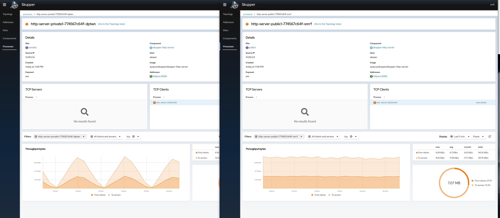

- Today, I'm looking at [skupperproject/skupper-example-http-load-balancing: Use Skupper to balance HTTP requests across sites](https://github.com/skupperproject/skupper-example-http-load-balancing/)
- Specifically, a variation I created to study the effect of [[link cost]] and how concurrency affects load balancing.
- On [vary-concurrency](https://github.com/pwright/skupper-example-http-load-balancing/tree/vary-concurrency) branch:
	- Two sites, public1 and private1
	- Linked with a cost = 50
	- Servers in both sites, but clients only in public1
	- Using TCP protocol
- The clients increment the number of open connections from 0 to 100 and then back to zero again.
- The results are:
	- Responses from public1 server only until the number of open connections >50
	- Responses start coming in from private1 when concurrency is increased
	- Responses from private1 ramp up to satisfy demand until the end of the cycle
- So, from the traffic to private1 ramps up and down as the number of concurrent connections increases and decreases whereas the traffic to public1 is steady
- 
- Conclusion: This experiment is not a realistic scenario, but it shows how you might implement cost to achieve either of the following:
	- I want my server to failover to a remote server if the server goes down, but I don't want to balance load.
		- Set the cost high, a big number like 999, the remote server won't see any traffic with the local server is working, but when the local server goes down all traffic will be directed to the remote server.
	- I want my server to balance traffic to a remote server.
		- Set the cost low, eg 1. When traffic is light, almost all the traffic will be handled by the local server, don't expect a round robin distribution.
	-
- More details about the site setup at [[vary-concurrency-public1]] and [[vary-concurrency-private1]]